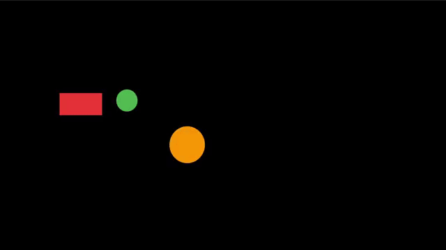

# flame_camera_tools

flame_camera_tools is a Flutter package that enhances camera functionality for games built with Flame. It provides a intuitive way to manage camera behavior, making it easier to create dynamic and immersive experiences in 2D game worlds.

<a title="Pub" href="https://pub.dev/packages/flame_camera_tools" ></a>
<a title="Pub Points" href="https://pub.dev/packages/flame_camera_tools/score" ></a>
<a title="Pub Likes" href="https://pub.dev/packages/flame_camera_tools/score" ></a>
<a title="Pub Downloads" href="https://pub.dev/packages/flame_camera_tools/score" ></a>


# Features
- Smooth Follow: The camera smoothly follows a target component, adjusting the speed based on the distance.
- Area Follow: The camera follows a target component only after the target moves outside a specified rectangular area. This is useful for creating "dead zones" where the camera does not immediately follow the target.
- Shake Effect: Apply a shake effect to any PositionProvider.
- Zooming: Zoom in/out.
- Rotating: Rotate the camera by an angle.
- Move Along Path: Move the camera sequentially through a series of points.
- Focus Effects: Focus the camera on a position or component.
- Customizable Effects: Modify the duration and curve of each effect.
- Chaining Effects: Seamlessly chain multiple effects using Futures.

## Usage

You can either instantiate your own CameraComponent directly or use the camera provided by the FlameGame class:

```dart
// Directly instantiate the CameraComponent
final camera = CameraComponent();
```

```dart
// Accessing the camera from FlameGame
final camera = game.camera;
```

### Follow a Component
Use `smoothFollow()` to make the camera smoothly follow a component with adjustable stiffness:

```dart
camera.smoothFollow(component, stiffness: 1.5);
```


Use `areaFollow()` to make the camera follow a component only once it moves outside a defined rectangular area:

```dart
camera.areaFollow(component, areaBounds: const Rect.fromLTRB(100, 100, 100, 100));
```


The above code will create a `200x200` “dead zone” around the target, where the camera does not follow it.

### Apply a Shake Effect
Create a shake effect with a specific duration, intensity, and curve:

```dart
camera.shake(intensity: 10, duration: 5, curve: Curves.linear);
```


The shaking effect is automatically weakened over time. If you do not want such behavior, set the `weakenOverTime` parameter to `false`.

### Zooming in/out

Zoom in/out with optional duration and curve:

```dart
camera.zoomTo(0.5, duration: 3, curve: Curves.easeInOut);
```


### Rotating

Rotate the camera by an angle with optional duration and curve:

```dart
// Rotates the camera by 45 degrees
camera.rotateBy(45, duration: 3, curve: Curves.easeInOut);
```


### Focusing the Camera

Move the camera to focus on a position, with optional duration and curve:

```dart
camera.focusOn(Vector2(200, 200), duration: 3, curve: Curves.easeInOut);
```
 

Move the camera to focus on a component, with optional duration and curve:

```dart
camera.focusOnComponent(component, duration: 3, curve: Curves.easeInOut);
``` 

### Move Along a Path

Move the camera sequentially along a series of points:

```dart
camera.moveAlongPath(
  [Vector2(100, 100), Vector2(200, 0), Vector2(300, 100)],
  durationPerPoint: 0.5,
  curve: Curves.easeInOut,
);
```
 

### Chaining Multiple Effects
You can chain multiple effects together for a sequence of camera movements:

```dart
camera
    .shake(intensity: 10, duration: 4)
    .then((_) => camera.zoomTo(0.25, duration: 3))
    .then((_) => camera.focusOnComponent(component, duration: 3))
    .then((_) => camera.rotateBy(45, duration: 2));
```

### Applying Multiple Effects at Once
You can also apply multiple effects simultaneously for more dynamic interactions:

```dart
camera
  ..shake(intensity: 7, duration: 4)
  ..zoomTo(0.75, duration: 2)
  ..rotateBy(90, duration: 2, curve: Curves.easeInOut);
```

# Why Use This Package?

This package allows for easy and smooth camera transitions, such as when you want to zoom in on an action, create a shake effect for a hit or explosion, or follow a character smoothly as they move through a level. The effects are customizable and can be chained to create complex camera behaviors that enhance your game's dynamic visuals.
