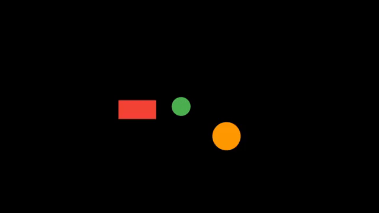
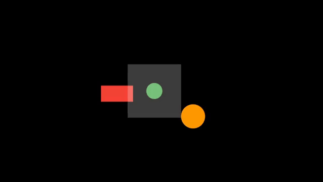

# flame\_camera\_tools

[](https://pub.dev/packages/flame_camera_tools)
[](https://pub.dev/packages/flame_camera_tools/score)
[](https://pub.dev/packages/flame_camera_tools/score)
[](https://pub.dev/packages/flame_camera_tools)

`flame_camera_tools` is a Flutter package that enhances camera functionality for games built with [Flame](https://flame-engine.org/).
It provides a set of convenient extensions for `CameraComponent` to handle smooth following, camera shake, zooming, rotating, path movement, and complex effect sequencing. This makes it easier to create dynamic and immersive 2D game experiences.

---

## Features

* **Smooth Follow:** The camera can smoothly follow a target component with adjustable stiffness. Supports configurable deadzones and offsets.
* **Shake Effect:** Apply a randomized shake effect to the camera or any `PositionProvider`.
* **Zooming:** Zoom in and out smoothly with optional duration and curve.
* **Rotating:** Rotate the camera by a specified angle with optional duration and curve.
* **Focus Effects:** Move the camera to focus on a specific position or component.
* **Customizable Effects:** Each effect allows control over duration, easing curve, and intensity.
* **Chaining Effects:** Sequence multiple effects using `Future`s for smooth transitions.
* **Simultaneous Effects:** Apply multiple effects at once for dynamic interactions.


## Usage

You can use your own `CameraComponent` or access the camera provided by `FlameGame`:

```dart
// Directly instantiate the CameraComponent
final camera = CameraComponent();
```

```dart
// Accessing the camera from FlameGame
final camera = game.camera;
```

---

### Smoothly Follow a Component





Use `chase()` to make the camera follow a target with adjustable stiffness and deadzone. It returns an `AdvancedFollowBehavior` instance, which allows you to tweak options like `offset`, `deadZone`, and `stiffness` later on:

```dart
final followBehavior = camera.chase(component, stiffness: 0.95);

// Later, you can adjust settings
followBehavior.offset = Vector2(0, -50);
followBehavior.stiffness = 0.9;
```

Optional parameters:

```dart
camera.chase(
  component,
  stiffness: 0.95,
  deadZone: RectangularDeadzone(left: 100, top: 100, right: 100, bottom: 100),
  offset: Vector2(0, -50),
  horizontalOnly: false,
  verticalOnly: false,
  snap: true, // immediately move camera to target
);
```

---

### Apply a Shake Effect

Create a shake effect with specific amplitude and duration:

```dart
await camera.shake(10.0, LinearEffectController(0.5));
```

* `amplitude`: Maximum displacement in pixels at the start of the effect.
* `controller`: Defines the duration, progression curve, and damping of the shake.

The shake effect automatically weakens over time.

---

### Zooming

Zoom in or out relative to the current zoom:

```dart
await camera.zoomBy(0.5, LinearEffectController(1.0));
```

Or zoom to an absolute zoom level:

```dart
await camera.zoomTo(2.0, LinearEffectController(1.0));
```

* `value`: Relative or absolute zoom level.
* `controller`: Controls duration, curve, and smoothing.

---

### Rotating

Rotate the camera by a relative angle (in radians):

```dart
await camera.rotateBy(45, LinearEffectController(1.0)); // rotate 45 degrees
```

* `angle`: Rotation in degrees.
* `controller`: Controls duration, curve, and smoothing.

---

### Focusing the Camera

Move the camera to a specific position:

```dart
await camera.lookAt(Vector2(200, 200), LinearEffectController(1.0));
```

---

### Chaining Multiple Effects

Chain multiple effects in sequence:

```dart
await camera.effectSequence([
  () => camera.shake(10.0, LinearEffectController(0.5)),
  () => camera.zoomTo(1.5, LinearEffectController(1.0)),
  () => camera.rotateBy(45, LinearEffectController(0.5)),
]);
```

---

### Applying Multiple Effects Simultaneously

You can apply multiple effects at the same time:

```dart
camera
  ..shake(7.0, LinearEffectController(4))
  ..zoomTo(0.75, LinearEffectController(1.0))
  ..rotateBy(45, LinearEffectController(1.0));
```

---

## Why Use This Package?

`flame_camera_tools` makes it easy to implement smooth and dynamic camera behavior:

* Follow players or objects seamlessly.
* Add impactful shake effects for hits, explosions, or environmental feedback.
* Zoom and rotate for dramatic or cinematic effects.
* Sequence and chain multiple effects for complex camera choreography.
* Fully customizable durations, curves, and intensity for precise control.

It’s a flexible, developer-friendly way to enhance the visual feel of any 2D game built with Flame.

---

## License

MIT License. See `LICENSE` for details.
